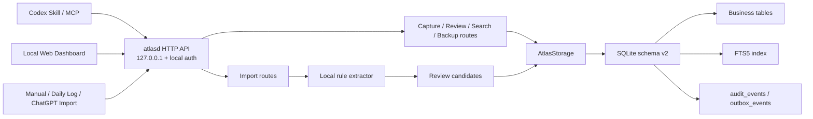

# Atlas

[中文](#中文快速开始) | [English](#english-quick-start)

## 中文快速开始

> **被打断没关系，Atlas 记得你做到哪里。**
>
> 生活不会等你做完一件事再开始下一件事。电话来了，孩子叫你，一场会议开始了，一个新想法又冒出来。Atlas 不要求你记住一切——它只替你记住三件事：**刚才做到哪里，下一步是什么，为什么值得继续。**

你不是没有想法，而是想法散落在聊天、搜索和做到一半的生活琐事里：查了一半的夏令营、还没预约的体检、等待回复的维修安排、突然想到的周末计划。一次打断，就可能让这些事情重新沉下去。传统待办工具还要求你停下手头工作，打开另一个 App，再重新整理一遍。

**Atlas 让你留在 Codex 对话里，直接说一句话。** 它把你明确想保留的灵感、决定和未完成事项记录成带来源、可审核的候选。以后无论换到哪个任务，都可以问 Atlas：“我上次做到哪里了？”或者“今天最值得继续什么？”本地 Web Dashboard 只负责集中 Review、Search 和管理，不是日常使用的必经入口。

### 30 秒理解 Atlas

1. **想到时就说：** `Atlas，请记住：下次继续比较这三家夏令营，先确认接送时间。`
2. **Atlas 先让你审核：** 它保存为一条待确认记录（Review Candidate），不会擅自执行，也不会把整段聊天都存下来。
3. **需要时直接问：** `Atlas，我有哪些做到一半的事情？` 或 `Atlas，今天最值得继续什么？`

例如，你说“有空给爸爸预约年度体检”，Atlas 可以把它保留为一个带来源的未完成事项；你说“下次家庭旅行住在火车站附近”，Atlas 可以把它保留为一个可追溯的决定。**你不需要先整理好自己，Atlas 帮你在想法出现的那一刻抓住下一步。**

### 最简单的安装方法（Windows 10/11 x64）

安装前只需要确保电脑上已经安装并可以正常打开 **Codex Desktop**。不需要管理员权限，也不需要另外安装 Node.js、pnpm、数据库或 API Key。

1. 打开 [Atlas 最新版本下载页](https://github.com/randyhe/atlas/releases/latest)。
2. 在页面的 **Assets** 区域下载 `Atlas-Windows-x64.zip`。建议同时下载 `Atlas-Windows-x64.zip.sha256` 用于安全校验。
3. 右键 ZIP，选择 **全部解压（Extract All）**。请先完整解压，不要直接在 ZIP 压缩包里面运行程序。
4. 打开解压后的文件夹，双击 **`Install Atlas.cmd`**。
5. 等待黑色命令窗口显示：

   ```text
   Atlas is installed and running. Open a new Codex task to use it.
   ```

   安装程序随后会自动打开 Atlas Dashboard。
6. 完全退出并重新打开 Codex，在 **Plugins → Atlas** 中确认 Atlas 已安装并点击 **Connect**。然后新建一个 Codex 对话，输入：

   > Atlas，请记住：明天继续比较夏令营，先确认接送时间。

### 怎样才算安装成功？

以下三项都满足，就说明 Atlas 已经可以正常使用：

- **安装窗口成功：** 显示 `Atlas is installed and running`，没有红色错误。
- **Dashboard 成功：** 浏览器自动打开 Atlas，并能看到 `Today`、`Capture`、`Review`、`Search` 等页面。
- **Codex 对话成功：** 在新对话中让 Atlas 记录一件事后，Codex 给出记录确认；打开 Dashboard 的 **Review** 页面可以看到这条新记录。

安装后最常用的说法：

```text
Atlas，请记住这个想法：周末带孩子去自然博物馆。
Atlas，把“下周给牙医打电话”记录为待办。
Atlas，我有哪些做到一半的事情？
Atlas，今天最值得继续做什么？
Atlas，搜索我之前关于家庭旅行住宿的决定，并显示来源。
Atlas，打开 Dashboard。
```

以后电脑重启或 Dashboard 没有打开时，只需再次双击 **`Start Atlas.cmd`**，不需要重复安装。Atlas 会优先使用 `127.0.0.1:4310`；如果该端口已被使用，会自动尝试 4311–4319。

### 常见问题

#### Windows 显示安全提醒怎么办？

当前 ZIP 提供 SHA-256 校验，但尚未使用商业 Authenticode 证书签名。请只从本项目的 GitHub Release 下载。可以在 PowerShell 中运行以下命令，并将结果与 `.sha256` 文件比较：

```powershell
Get-FileHash .\Atlas-Windows-x64.zip -Algorithm SHA256
```

确认校验值一致后，再根据 Windows 提示选择是否运行。Atlas 安装程序不会申请管理员权限、修改注册表或添加防火墙规则。

#### 双击安装后，Codex 中看不到 Atlas

完全退出 Codex 后重新打开，然后进入 **Plugins → Atlas** 并点击 **Connect**。必须新建一个 Codex 对话，已经打开的旧对话可能不会立即加载新插件。

#### Dashboard 没有自动打开

双击解压目录中的 **`Start Atlas.cmd`**。它会自动寻找 4310–4319 中可用的本机端口并打开浏览器。如果窗口提示所有端口都被占用，请关闭旧的 Atlas 进程或占用这些端口的本地程序，再重新运行。

#### 可以移动或删除解压后的文件夹吗？

Atlas 是绿色版本，程序、插件副本和个人数据都保存在解压目录中。安装后不要随意移动或删除这个目录。个人数据位于 `work/data`；删除 Atlas 前请先备份该目录。双击 **`Uninstall Atlas.cmd`** 可以移除 Codex 插件，同时保留数据。

---

## English Quick Start

> **Life interrupts. Atlas remembers where you left off.**
>
> Life rarely waits for you to finish one thing before starting another. The phone rings, your child needs you, a meeting begins, or a new idea appears. Atlas does not ask you to remember everything. It remembers three things: **where you stopped, what comes next, and why it is worth continuing.**

You do not run out of ideas. They scatter across chats, searches, and half-finished parts of daily life: a summer camp you were comparing, a health appointment you meant to book, a repair visit awaiting a reply, or a weekend plan that appeared for a moment. One interruption can bury them again. Traditional task apps add another interruption: stop what you are doing, open another app, and organize everything again.

**Atlas lets you stay in the Codex conversation and simply say what should not be lost.** It turns explicit ideas, decisions, and unfinished work into reviewable candidates with their sources. Later, from another task, ask “Where did I leave off?” or “What is worth continuing today?” The local Web Dashboard is an optional place for Review, Search, and management—not a required daily entry point.

### Understand Atlas in 30 seconds

1. **Say it when it happens:** `Atlas, remember this: keep comparing these three summer camps and check pickup times first.`
2. **Review before it becomes memory:** Atlas creates a Review Candidate. It does not execute the request or archive the entire conversation.
3. **Ask when you need it:** `Atlas, what unfinished work should I resume?` or `Atlas, what is worth continuing today?`

For example, “Book Dad's annual checkup when I have time” can become a sourced unfinished action. “Stay near the train station on our next family trip” can become a traceable decision. **You do not have to organize yourself before capturing a thought; Atlas catches the next step the moment it appears.**

Atlas is an **Apps for Your Life** project for OpenAI Build Week. It is not a general chat archive and does not claim access to all ChatGPT or Codex history.

### The easiest way to install Atlas (Windows 10/11 x64)

Before you begin, make sure **Codex Desktop** is installed and opens normally. You do not need administrator rights, Node.js, pnpm, a separate database, an API key, or a hosted Atlas account.

1. Open the [latest Atlas release](https://github.com/randyhe/atlas/releases/latest).
2. Under **Assets**, download `Atlas-Windows-x64.zip`. We also recommend downloading `Atlas-Windows-x64.zip.sha256` so you can verify the package.
3. Right-click the ZIP and choose **Extract All**. Do not run Atlas from inside the ZIP file.
4. Open the extracted folder and double-click **`Install Atlas.cmd`**.
5. Wait until the command window displays:

   ```text
   Atlas is installed and running. Open a new Codex task to use it.
   ```

   The installer will also open the Atlas Dashboard in your browser.
6. Fully quit and restart Codex. Open **Plugins → Atlas**, confirm that Atlas is installed, and click **Connect**. Then start a new Codex conversation and enter:

   > Atlas, remember this: continue comparing summer camps tomorrow and check pickup times first.

### How do I know the installation succeeded?

Atlas is ready when all three checks pass:

- **Installer:** the command window says `Atlas is installed and running` and shows no red error.
- **Dashboard:** your browser opens Atlas and you can access `Today`, `Capture`, `Review`, and `Search`.
- **Codex conversation:** Codex confirms your Atlas capture, and the new item appears on the Dashboard's **Review** page.

### What can I say to Atlas?

```text
Atlas, remember this idea: take the kids to the natural history museum this weekend.
Atlas, save “call the dentist next week” as a task.
Atlas, what unfinished work should I resume?
Atlas, what should I focus on today?
Atlas, search for my earlier decision about where to stay on our family trip and show the source.
Atlas, open the Dashboard.
```

After restarting Windows, or whenever the Dashboard is not running, double-click **`Start Atlas.cmd`**. You do not need to reinstall Atlas. It first tries `127.0.0.1:4310` and automatically falls back through ports 4311–4319 when necessary.

### Troubleshooting

#### Windows shows a security warning

The current release includes a published SHA-256 checksum but is not yet signed with a commercial Authenticode certificate. Download Atlas only from this project's GitHub Releases page. In PowerShell, verify the ZIP with:

```powershell
Get-FileHash .\Atlas-Windows-x64.zip -Algorithm SHA256
```

Compare the result with `Atlas-Windows-x64.zip.sha256` before deciding whether to run the installer. Atlas does not request administrator rights, edit the registry, or create a Windows Firewall rule.

#### Atlas does not appear in Codex after installation

Fully quit and restart Codex, open **Plugins → Atlas**, and click **Connect**. Start a new conversation because one that was already open might not load the newly installed plugin immediately.

#### The Dashboard does not open

Double-click **`Start Atlas.cmd`** in the extracted folder. It finds an available local port from 4310 through 4319 and opens the browser automatically. If the command window says that all ports are occupied, close an older Atlas process or another local application using those ports, then try again.

#### Can I move or delete the extracted folder?

Atlas is a portable release: the application, installed plugin copy, and personal data remain under the extracted folder. Do not move or delete it after installation. Your data is stored in `work/data`; back up that directory before removing Atlas. Double-click **`Uninstall Atlas.cmd`** to unregister the Codex plugin while preserving the data.

---

## Product and technical reference

### V1 guarantees

- Local capture, review, open-loop tracking, and FTS search work without an AI API key.
- SQLite is the runtime source of truth.
- Sanitized exports include only personal records and intentionally exclude restricted and work-summary-only data.
- Conversation capture records `codex` as its source and supports Open Loop, Decision, and Reference candidates.
- Codex integration is the preferred interaction layer, while the local API and Web dashboard preserve independent access to the data.
- The default configuration sets the monthly external-service budget to $0 and does not enable usage-based AI APIs. Electricity, storage, connectivity, and any existing Codex subscription are outside that statement.
- The Windows release generates a 256-bit per-user token protected with Windows DPAPI. Browser access uses an HttpOnly, SameSite session cookie; Codex MCP calls use the same local token.
- The service binds only to `127.0.0.1`. It never creates a firewall exception, listens on the LAN, or enables a public tunnel.

### Golden journeys

1. Import or capture an explicit open loop, inspect its Evidence, accept it in Review, move it through Today, then mark it done or scheduled.
2. Capture the same intent from a second source, inspect the **Possible duplicate** hint, merge the Evidence, then undo only the added Evidence link.
3. Import content marked as Restricted, including adversarial strings, and verify that it remains inert data, is redacted from ordinary responses, and does not enter Search or sanitized exports.

### Architecture



The `atlasd` package is the only component that opens SQLite for writes. Web, MCP, and import clients use the HTTP API and never open the database directly. Offline restore runs through the `atlasd` restore command and acquires the same exclusive data-directory lock.

Imports, URLs, and commands are always treated as untrusted text. For ChatGPT Export imports, the deterministic `competition-1` extractor reads only user/human messages; Manual and Daily Log imports are treated as user-confirmed input. It emits at most three candidates in Decision → Waiting → Open Loop order and sends every result to Review.

### Local entry points

- Codex: say “Remember this in Atlas,” “What unfinished work should I resume?”, or “Search Atlas for …”. The installed skill uses the local API fallback when MCP is not exposed.
- Plugin: the Windows installer registers the package-local `atlas-release` marketplace and installs `atlas@atlas-release`; open a new Codex conversation after installation.
- Web review workspace: the installer opens the selected loopback port. Atlas prefers 4310 and safely falls back through 4319.

### Development from source

```powershell
pnpm install
pnpm check
pnpm build
pnpm start
```

Open `http://127.0.0.1:4310`. When running from source on Windows, runtime data defaults to `%LOCALAPPDATA%\Atlas`; use `ATLAS_DATA_DIR` to select a different development directory. The downloadable Windows release uses its own portable `work/data` directory instead.

For front-end development, run `pnpm dev` and `pnpm dev:web` in separate terminals, then open `http://127.0.0.1:4311`.

### Import endpoints

- `POST /api/v1/imports/manual`
- `POST /api/v1/imports/daily-log`
- `POST /api/v1/imports/chatgpt-export`

Imported text is always treated as untrusted data and every candidate enters Review during Alpha.

ChatGPT Export is limited to 12 MB per HTTP request and 1,000 conversations. It is a manual historical fallback, not automatic history access.

### Competition evidence

The repeatable synthetic harness is documented in [`tests/competition/README.md`](tests/competition/README.md). The visible 30-sample Development set produces Open Loop TP 18 / FP 0 / FN 0 and Decision TP 6 / FP 0 / FN 0. After rule freeze, QA generated and ran the separate 50-sample Holdout once: Open Loop TP 35 / FP 0 / FN 0 with a Wilson 95% precision/recall interval of 90.11%–100%. These results are not retention evidence or a real 14-day Alpha.

The original capability probe is in [`docs/competition/capability-probe-2026-07-15.md`](docs/competition/capability-probe-2026-07-15.md). The later [`conversation-first probe`](docs/competition/conversation-first-probe-2026-07-17.md) verified all 11 MCP tools and a typed `codex` capture against a non-production database. MCP availability depends on the Codex host; when MCP is unavailable, the installed Atlas skill uses the verified loopback HTTP fallback without forcing the user into the Dashboard.

Windows release packaging and judge instructions are in [`packaging/windows/README-TESTING.md`](packaging/windows/README-TESTING.md). The release builder bundles a matching Node runtime and a self-contained MCP server. Normal installation creates portable data under the extracted release; `--demo` uses a separate synthetic data directory. Neither mode reads the normal `%LOCALAPPDATA%\Atlas` database.

### Security, trust, and license

- Atlas is local-first and imported text is always inert, untrusted data.
- The installer does not request elevation, edit the registry, or change Windows Firewall.
- `atlasd` always binds to `127.0.0.1`. The Windows launcher selects a port from 4310 through 4319; if all ten are occupied, startup stops safely.
- Authentication secrets are protected for the current Windows user with DPAPI and are never committed to Git or included in the ZIP.
- Release ZIPs publish SHA-256 hashes. Authenticode status is stated explicitly and never implied.
- Atlas source code is released under the [MIT License](LICENSE). Bundled runtime dependencies remain under their own licenses; see [Third-Party Notices](THIRD-PARTY-NOTICES.md).

### Human and Codex contribution

The user chose the product promise, review-first workflow, schema v2 boundary, privacy model, zero-paid-provider configuration, competition claims, and release gates. Codex assisted with implementation, tests, architecture review, synthetic evaluation, and packaging. Exact model-version claims should be made only when the submission host exposes verifiable model metadata; this repository does not invent a minor model version.

The post-2026-07-13 implementation history is preserved in the repository, beginning with `a5bcf40` (local alpha baseline) and `6ab639e` (P0 review and safe restore), followed by the Build Week competition commits.
