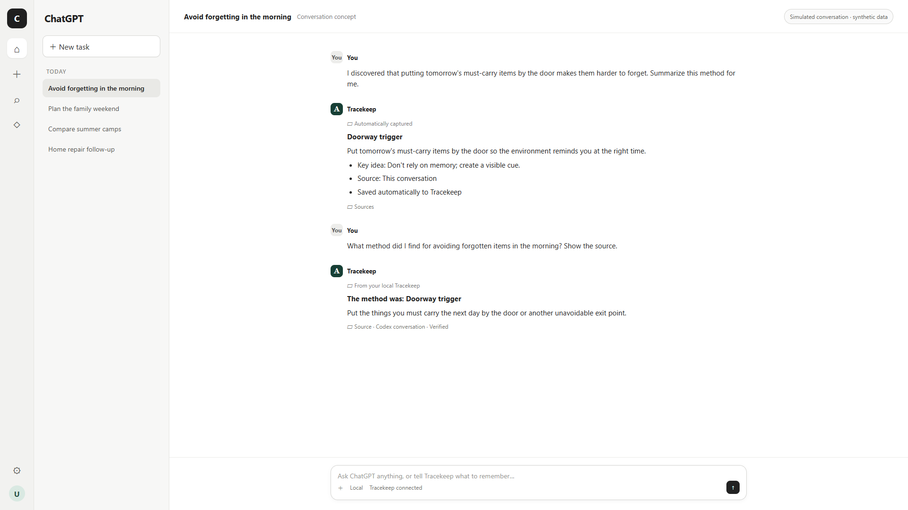

# Tracekeep

> **Life interrupts. Tracekeep remembers where you left off.**

[](https://github.com/randyhe/tracekeep/actions/workflows/ci.yml)
[](https://github.com/randyhe/tracekeep/releases/latest)
[](LICENSE)

[Download Tracekeep v0.4.0 for Windows](https://github.com/randyhe/tracekeep/releases/latest) · [中文说明](README.zh-CN.md) · [How it works](#how-tracekeep-works) · [Privacy & security](#privacy-security-and-cost)

> **Current release (July 21, 2026):** **Tracekeep v0.4.0** is the current Windows release.

Life rarely lets you finish one thing before the next begins. A call comes in, your child needs you, a meeting starts, or a new idea appears. The camp comparison you paused, the checkup you meant to book, and the reply you were waiting for can disappear beneath the next interruption.

**Tracekeep is a local second brain for Codex.** Once installed and enabled, it notices when a meaningful turn ends and turns the useful result into sourced learning notes, actions, and decisions. A conversation about a paper, a document you shared, a useful web page, an unfinished family plan, or an idea worth revisiting no longer disappears when the next interruption arrives.

**Tracekeep remembers: Where did you stop? What should you do next? Why is it worth continuing?**



*English, privacy-safe recreation of the product-owner UAT: an ordinary conversation is preserved, then recalled with source evidence. Tracekeep currently ships as a local Codex plugin; exact host layout may vary.*

## Use Tracekeep in 30 seconds

1. **Talk naturally**

   > I discovered that putting tomorrow's must-carry items by the door makes them harder to forget. Summarize this method for me.

2. **Ask when you need it**

   > What method did I find for avoiding forgotten items in the morning? Show the source.

You can also talk naturally:

```text
I have an idea: take the kids to the natural history museum this weekend. Help me think it through.
I need to call the dentist next week.
What should I focus on today?
Find my earlier family-trip decision and show its source.
Open the Tracekeep Dashboard.
```

You do not need to say “remember this” or prefix a message with “Tracekeep.” At the end of a meaningful completed Codex turn, Tracekeep automatically preserves useful learning references and proposes actions, decisions, or uncertain items for Review. Explicit capture remains available when something must be saved immediately.

## Install on Windows

Tracekeep is distributed as a portable Windows 10/11 x64 package. It requires Codex Desktop, but does not require administrator rights, Node.js, pnpm, a separate database, an API key, or a hosted Tracekeep account.

1. Open the [latest Tracekeep release](https://github.com/randyhe/tracekeep/releases/latest).
2. Under **Assets**, download `Tracekeep-Windows-x64.zip` and, preferably, `Tracekeep-Windows-x64.zip.sha256`.
3. Right-click the ZIP and choose **Extract All**. Do not run Tracekeep from inside the ZIP.
4. Open the extracted folder and double-click **`Install Tracekeep.cmd`**.
5. Wait for this message:

   ```text
   Tracekeep is installed and running. Open a new Codex task to use it.
   ```

6. Fully quit and restart Codex. Open **Plugins → Tracekeep**, click **Connect**, then start a new conversation.

### How to know installation succeeded

Tracekeep is ready when all three checks pass:

- **Installer:** the command window says `Tracekeep is installed and running` with no red error.
- **Dashboard:** the browser opens Tracekeep and shows `Today`, `Capture`, `Learning`, `Review`, and `Search`.
- **Codex:** finish a meaningful test conversation; its learning note appears under **Learning**, while any proposed action appears under **Review**.

After restarting Windows, double-click **`Start Tracekeep.cmd`**. Tracekeep first tries `127.0.0.1:4310` and safely falls back through ports 4311–4319. It never listens on the LAN or creates a Windows Firewall rule.

For checksum verification and common installation problems, see the [Windows testing guide](packaging/windows/README-TESTING.md).

## How Tracekeep works

Tracekeep is designed around two everyday actions:

- **Let the conversation settle:** when a meaningful Codex turn finishes, Tracekeep extracts the useful result automatically.
- **Resume with context:** ask Tracekeep what remains unfinished or search earlier records with their sources.

The local Stop hook observes only completed turns while Tracekeep is installed, trusted, and enabled. It does not scan every historical conversation. Tracekeep skips short social exchanges and credential-like text. For a personal turn, useful conclusions, documents, papers, and URLs become accepted Learning Notes; proposed actions, decisions, and uncertain items remain in Review. Work-related or restricted material is never auto-accepted.

Tracekeep stores structured results, bounded summaries, source identifiers, and evidence needed for recall. It does not execute imported instructions or automatically open captured URLs. If Tracekeep is temporarily offline, the plugin keeps a private local retry queue. You can pause automatic capture at any time under **Settings** without disabling explicit capture, search, or recall.

The Dashboard provides **Learning**, **Review**, **Search**, Today, Sources, and settings. It is a supporting workspace; everyday thinking and recall still begin in the conversation.

Tracekeep does not claim automatic access to all ChatGPT or Codex history. ChatGPT Export remains the manual historical fallback.

### Roadmap: ChatGPT Direct on mobile

The planned mobile experience is **ChatGPT Direct**, not a phone browser remotely controlling the desktop Dashboard. A user should be able to talk naturally and let a meaningful turn settle automatically, or ask what to resume, directly in the ChatGPT mobile conversation.

This capability is not shipped in v0.4.0. The planned design uses a ChatGPT App with a remote HTTPS MCP gateway and OAuth 2.1. A small outbound sync agent on the user's computer transfers reviewable records to the local `tracekeepd`; SQLite remains the authoritative store. The gateway is a short-lived transport queue, not a cloud copy of the Tracekeep database, and full conversations are not copied by default.

See the [ChatGPT Direct mobile roadmap](docs/product/chatgpt-direct-mobile-roadmap.md) for the target user flow, architecture, privacy boundary, delivery phases, and release gates.

### Dashboard for review and control

The Web Dashboard is the place to review several records together, inspect evidence, search, merge duplicates, and manage lifecycle states. It supports the conversation-first experience; it is not required before every capture or recall.


## Privacy, security, and cost

- **Local-first:** `tracekeepd` binds only to `127.0.0.1`; SQLite remains on the user's computer.
- **Local authentication:** the Windows release creates a 256-bit token protected with Windows DPAPI and uses an HttpOnly, SameSite browser session cookie.
- **Untrusted imports:** imported text, commands, and URLs remain inert data. Restricted content is excluded from ordinary search, sanitized exports, logs, and screenshots.
- **No paid provider required:** capture, review, open-loop tracking, backup, and FTS5 search work without an AI API key. Tracekeep does not silently enable usage-based AI APIs or cloud hosting.
- **Portable release:** the installer does not request elevation, edit the registry, or modify Windows Firewall.
- **Verifiable download:** every release ZIP includes a SHA-256 checksum. The current package is not Authenticode-signed; Windows may display a security warning.

See [SECURITY.md](SECURITY.md) for the threat boundary, reporting process, and current limitations.

## Behavior implemented in v0.4.0

- Automatic meaningful-turn capture through a trusted local Codex Stop hook.
- Sourced Learning Notes for conversations, notes, documents, papers, and web pages.
- Automatic acceptance for low-risk personal references; Review-first actions, decisions, work summaries, and restricted items.
- A user-controlled automatic-capture switch and a dedicated Learning view.
- Explicit conversation-first capture for Open Loop, Decision, and Reference candidates.
- Review-first acceptance, editing, rejection, duplicate merge, and undo.
- Open, waiting, scheduled, done, and dismissed lifecycle states.
- Sourced FTS5 search, local backup and restore, and sanitized export.
- Manual, Daily Log, and ChatGPT Export imports with deterministic local extraction.
- Portable Windows launcher with loopback-only port fallback.

## Built with Codex and GPT-5.6

Tracekeep existed as a local Alpha before OpenAI Build Week. The work submitted for judging is the meaningful extension completed during the July 13–21, 2026 submission period, documented by the repository's dated [pull-request history](https://github.com/randyhe/tracekeep/pulls?q=is%3Apr+is%3Amerged) and [competition evidence](docs/competition/README.md).

Codex and GPT-5.6 served as the collaborative engineering environment for product critique, architecture tradeoffs, implementation, regression testing, privacy review, UAT playback, Windows packaging, and release verification. They accelerated the automatic completed-turn capture flow, sourced Learning Notes, reversible Review lifecycle, privacy and network probes, bilingual documentation, and reproducible demo assets.

The human owner made the consequential product decisions: local SQLite remains authoritative; proposed actions and decisions require Review; imported instructions stay inert; restricted content stays out of ordinary outputs; complete chat-history access is not claimed; and paid providers, cloud hosting, and autonomous external writes remain outside V1. The current result is a runnable Windows release, not a prompt-only prototype.

## Development

Tracekeep uses Node.js, TypeScript, Fastify, React, and SQLite.

```powershell
pnpm install
pnpm check
pnpm start
```

Open `http://127.0.0.1:4310`. Development data defaults to `%LOCALAPPDATA%\Tracekeep`; set `TRACEKEEP_DATA_DIR` to isolate it. The downloadable release instead uses its portable `work/data` directory.

- [Technical reference and architecture](docs/technical-reference.md)
- [ChatGPT Direct mobile roadmap](docs/product/chatgpt-direct-mobile-roadmap.md)
- [Competition evidence and claim boundaries](docs/competition/README.md)
- [Requirements traceability](docs/quality/requirements-traceability.md)
- [Contributing](CONTRIBUTING.md)

## License and attribution

Tracekeep is available under the [MIT License](LICENSE). Bundled dependencies remain under their own licenses; see [Third-Party Notices](THIRD-PARTY-NOTICES.md).

## Built with Codex and GPT-5.6

The product owner defined the user problem, automatic conversation-to-memory interaction, review workflow, privacy and cost boundaries, and release gates. Codex and GPT-5.6 were then used as the collaborative engineering environment to inspect the live repository, challenge product and architecture assumptions, implement scoped changes, generate and run regression tests, diagnose failures, exercise synthetic UAT journeys, scan privacy boundaries, and build the portable Windows release.

The human owner remained responsible for product, privacy, cost, and release decisions. Tracekeep keeps this collaboration auditable through public commits, test evidence, capability probes, and explicit claim boundaries instead of presenting generated output as autonomous product ownership.
