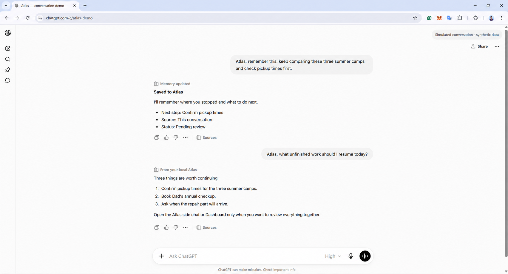

# Atlas

> **Life interrupts. Atlas remembers where you left off.**

[](https://github.com/randyhe/atlas/actions/workflows/ci.yml)
[](https://github.com/randyhe/atlas/releases/latest)
[](LICENSE)

[Download for Windows](https://github.com/randyhe/atlas/releases/latest) · [中文说明](README.zh-CN.md) · [How it works](#how-atlas-works) · [Privacy & security](#privacy-security-and-cost)

Life rarely lets you finish one thing before the next begins. A call comes in, your child needs you, a meeting starts, or a new idea appears. The camp comparison you paused, the checkup you meant to book, and the reply you were waiting for can disappear beneath the next interruption.

**Atlas is a conversation-first memory and action system for Codex.** Stay in the conversation and say what should not be lost. Later, ask where you stopped, what to do next, or why an idea was worth continuing. Atlas keeps the answer connected to its source, while a local Web Dashboard gives you one place to review and manage everything.

**Atlas remembers: Where did you stop? What should you do next? Why is it worth continuing?**



*Conversation-first interaction concept using synthetic data and the provided ChatGPT interface as its visual reference. Atlas currently ships as a local Codex plugin; the exact host layout and available surfaces may vary.*

## Use Atlas in 30 seconds

1. **Say it when it happens**

   > Atlas, remember this: keep comparing these three summer camps and check pickup times first.

2. **Ask when you need it**

   > Atlas, what unfinished work should I resume?

You can also say:

```text
Atlas, remember this idea: take the kids to the natural history museum this weekend.
Atlas, save “call the dentist next week” as a task.
Atlas, what should I focus on today?
Atlas, search for my earlier family-trip decision and show its source.
Atlas, open the Dashboard.
```

## Install on Windows

Atlas is distributed as a portable Windows 10/11 x64 package. It requires Codex Desktop, but does not require administrator rights, Node.js, pnpm, a separate database, an API key, or a hosted Atlas account.

1. Open the [latest Atlas release](https://github.com/randyhe/atlas/releases/latest).
2. Under **Assets**, download `Atlas-Windows-x64.zip` and, preferably, `Atlas-Windows-x64.zip.sha256`.
3. Right-click the ZIP and choose **Extract All**. Do not run Atlas from inside the ZIP.
4. Open the extracted folder and double-click **`Install Atlas.cmd`**.
5. Wait for this message:

   ```text
   Atlas is installed and running. Open a new Codex task to use it.
   ```

6. Fully quit and restart Codex. Open **Plugins → Atlas**, click **Connect**, then start a new conversation.

### How to know installation succeeded

Atlas is ready when all three checks pass:

- **Installer:** the command window says `Atlas is installed and running` with no red error.
- **Dashboard:** the browser opens Atlas and shows `Today`, `Capture`, `Review`, and `Search`.
- **Codex:** Codex confirms a capture and the new item appears under **Review** in the Dashboard.

After restarting Windows, double-click **`Start Atlas.cmd`**. Atlas first tries `127.0.0.1:4310` and safely falls back through ports 4311–4319. It never listens on the LAN or creates a Windows Firewall rule.

For checksum verification and common installation problems, see the [Windows testing guide](packaging/windows/README-TESTING.md).

## How Atlas works

Atlas is designed around two everyday actions:

- **Capture in conversation:** explicitly ask Atlas to remember an idea, decision, reference, or future action.
- **Resume with context:** ask Atlas what remains unfinished or search earlier records with their sources.

An explicit Codex capture stores only the content you deliberately give Atlas; it does not silently archive the whole current conversation. A manually imported ChatGPT Export is different: imported conversations are stored locally so Atlas can extract candidates, search them, and preserve source traceability.

Newly extracted items enter **Review** before becoming accepted actions or decisions. Atlas does not execute imported instructions or open imported URLs. The Dashboard is an optional workspace for reviewing, searching, merging duplicates, scheduling, completing, or dismissing records.

In the main conversation, Atlas responds as ordinary assistant text with a lightweight save or source status. It does not embed the Dashboard in the conversation body. A supported host may show a compact Atlas summary in a side chat, while the full Dashboard remains a separate local workspace.

Atlas is not a general chat archive and does not claim automatic access to all ChatGPT or Codex history. ChatGPT Export is a manual historical fallback.

### Dashboard for review and control

The Web Dashboard is the place to review several records together, inspect evidence, search, merge duplicates, and manage lifecycle states. It supports the conversation-first experience; it is not required before every capture or recall.


## Privacy, security, and cost

- **Local-first:** `atlasd` binds only to `127.0.0.1`; SQLite remains on the user's computer.
- **Local authentication:** the Windows release creates a 256-bit token protected with Windows DPAPI and uses an HttpOnly, SameSite browser session cookie.
- **Untrusted imports:** imported text, commands, and URLs remain inert data. Restricted content is excluded from ordinary search, sanitized exports, logs, and screenshots.
- **No paid provider required:** capture, review, open-loop tracking, backup, and FTS5 search work without an AI API key. Atlas does not silently enable usage-based AI APIs or cloud hosting.
- **Portable release:** the installer does not request elevation, edit the registry, or modify Windows Firewall.
- **Verifiable download:** every release ZIP includes a SHA-256 checksum. The current package is not Authenticode-signed; Windows may display a security warning.

See [SECURITY.md](SECURITY.md) for the threat boundary, reporting process, and current limitations.

## Verified behavior in v0.2.0

- Conversation-first capture for Open Loop, Decision, and Reference candidates.
- Review-first acceptance, editing, rejection, duplicate merge, and undo.
- Open, waiting, scheduled, done, and dismissed lifecycle states.
- Sourced FTS5 search, local backup and restore, and sanitized export.
- Manual, Daily Log, and ChatGPT Export imports with deterministic local extraction.
- Portable Windows launcher with loopback-only port fallback.

## Development

Atlas uses Node.js, TypeScript, Fastify, React, and SQLite.

```powershell
pnpm install
pnpm check
pnpm start
```

Open `http://127.0.0.1:4310`. Development data defaults to `%LOCALAPPDATA%\Atlas`; set `ATLAS_DATA_DIR` to isolate it. The downloadable release instead uses its portable `work/data` directory.

- [Technical reference and architecture](docs/technical-reference.md)
- [Competition evidence and claim boundaries](docs/competition/README.md)
- [Requirements traceability](docs/quality/requirements-traceability.md)
- [Contributing](CONTRIBUTING.md)

## License and attribution

Atlas is available under the [MIT License](LICENSE). Bundled dependencies remain under their own licenses; see [Third-Party Notices](THIRD-PARTY-NOTICES.md).

The product owner defined the problem, interaction model, review-first workflow, privacy boundary, schema v2 constraint, cost boundary, and release gates. Codex assisted with implementation, tests, architecture review, synthetic evaluation, and packaging. The repository does not claim a model minor version that cannot be verified from host metadata.
