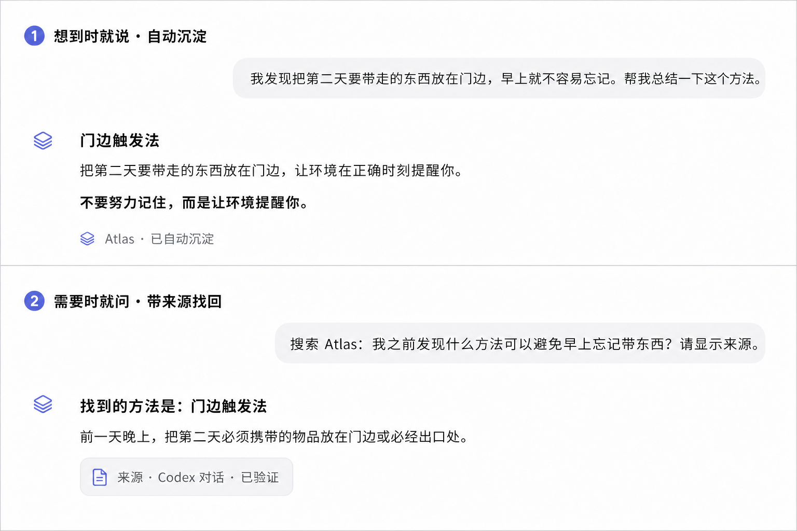
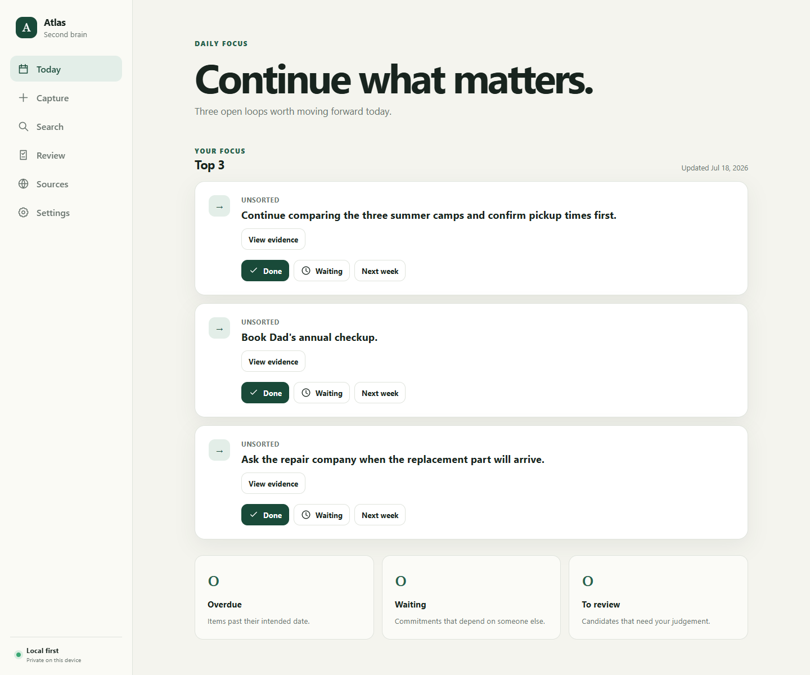

# Tracekeep

> **被打断没关系，Tracekeep 记得你做到哪里。**

[已发布版本（当前安装包仍为 Atlas v0.3.0）](https://github.com/randyhe/tracekeep/releases/latest) · [English](README.md) · [工作原理](#tracekeep-如何工作) · [隐私安全与费用](#隐私安全与费用)

> **更名状态（2026-07-21）：** 源码和 GitHub 仓库已经使用 **Tracekeep**；当前最新公开 Windows 安装包仍是旧版 **Atlas v0.3.0**。Tracekeep 品牌的 Windows 包已完成构建和验证，但尚未发布。旧 Atlas 数据保持兼容；参见[更名迁移说明](docs/project/rename-migration.md)。

生活不会等你做完一件事再开始下一件事。电话来了，孩子叫你，一场会议开始了，一个新想法又冒出来。查了一半的夏令营、还没预约的体检、等待回复的维修安排，都可能被下一次打断重新埋下去。

**Tracekeep 是一个以 Codex 对话为入口的本地第二大脑。** 安装并启用后，每当一次有价值的对话回合结束，它会自动把真正值得保留的内容沉淀成带来源的学习笔记、行动和决定。研究过的论文、发给 Codex 的文档、一个有用的网址、做到一半的生活安排，或一闪而过但值得继续的想法，都不会因为下一次打断而消失。

**它会替你记住：刚才做到哪里？下一步做什么？为什么值得继续？**



*基于产品负责人真实 UAT 制作的隐私安全复现：一次普通对话被自动沉淀，随后在另一个 Codex 任务中带来源找回。该记录完成于更名前，因此截图保留旧界面名称，作为历史测试证据。Tracekeep 当前以本地 Codex 插件形式交付；具体宿主界面可能有所变化。*

## 30 秒理解 Tracekeep

1. **想到时自然地说**

   > 我发现把第二天要带走的东西放在门边，早上就不容易忘记。帮我总结一下这个方法。

2. **需要时就问**

   > 搜索 Tracekeep：我之前发现什么方法可以避免早上忘记带东西？请显示来源。

你还可以这样说：

```text
Tracekeep，请记住这个想法：周末带孩子去自然博物馆。
Tracekeep，把“下周给牙医打电话”记录为待办。
Tracekeep，今天最值得继续做什么？
Tracekeep，搜索我之前关于家庭旅行住宿的决定，并显示来源。
Tracekeep，打开 Dashboard。
```

你不需要每次都说“请记住”。一次有价值的 Codex 回合结束后，Tracekeep 会自动保存学习内容，并把可能影响计划的行动或决定放进 Review。明确记录仍然保留，适合你希望马上确认保存的事情。

## Windows 安装方法

Tracekeep 将提供 Windows 10/11 x64 绿色版。电脑需要已安装 Codex Desktop，但不需要管理员权限，也不需要另外安装 Node.js、pnpm、数据库、API Key 或云端账户。

首个 Tracekeep 品牌的 GitHub Release 尚未发布。[当前最新版本](https://github.com/randyhe/tracekeep/releases/latest)仍包含 Atlas 名称的安装文件。首个 Tracekeep 版本发布后，请按以下步骤安装：

1. 打开[最新版本页面](https://github.com/randyhe/tracekeep/releases/latest)，并确认该版本已经使用 Tracekeep 品牌。
2. 在 **Assets** 中下载 `Tracekeep-Windows-x64.zip`，建议同时下载 `Tracekeep-Windows-x64.zip.sha256`。
3. 右键 ZIP，选择 **全部解压（Extract All）**。不要直接在压缩包里运行。
4. 打开解压后的文件夹，双击 **`Install Tracekeep.cmd`**。
5. 等待窗口显示：

   ```text
   Tracekeep is installed and running. Open a new Codex task to use it.
   ```

6. 完全退出并重新打开 Codex，进入 **Plugins → Tracekeep**，点击 **Connect**，然后新建一个对话。

### 怎样才算安装成功？

以下三项都满足，说明 Tracekeep 已经可以使用：

- **安装窗口：** 显示 `Tracekeep is installed and running`，没有红色错误。
- **Dashboard：** 浏览器打开 Tracekeep，并能看到 `Today`、`Learning`、`Review` 和 `Search`。
- **Codex 对话：** 完成一段有实际内容的测试对话后，学习结论出现在 **Learning**；如果包含下一步行动，则同时出现在 **Review**。

电脑重启后，只需双击 **`Start Tracekeep.cmd`**。Tracekeep 优先使用 `127.0.0.1:4310`；端口已被使用时会依次尝试 4311–4319。它不会监听局域网，也不会创建 Windows 防火墙规则。

校验下载文件和排查安装问题，请查看 [Windows 测试说明](packaging/windows/README-TESTING.md)。

## Tracekeep 如何工作

Tracekeep 围绕两个最常用的动作设计：

- **让对话自然沉淀：** 有价值的 Codex 回合结束时，Tracekeep 自动提取值得保留的内容。
- **带着上下文继续：** 询问还有哪些事情没有闭环，或搜索以前的记录和来源。

本地 Stop Hook 只处理 Tracekeep 安装、信任并启用之后完成的回合，不会扫描全部历史。简短寒暄和疑似密码、Token 的内容会跳过。个人对话中的有用结论、文档、论文和网址会自动成为 Learning Notes；行动和决定仍进入 Review。工作摘要、Restricted 内容和不确定内容不会自动接纳。

Tracekeep 保存结构化结果、受限长度的摘要、来源标识和回忆所需的证据，不执行导入文字中的命令，也不会自动打开捕获到的网址。服务临时离线时，插件使用本地私有队列稍后重试。你可以在 **Settings** 随时暂停自动沉淀；主动记录、搜索和回忆仍可继续使用。

Dashboard 增加 **Learning** 页面，并继续提供 Review、Search、Today、Sources 和 Settings。它是集中查看和管理的位置；日常思考和回忆仍从对话开始。

Tracekeep 不是完整聊天归档工具，也不宣称可以自动读取全部 ChatGPT 或 Codex 历史。ChatGPT Export 只是手动导入历史的兜底方式。

### 后续方向：手机端 ChatGPT Direct

Tracekeep 计划中的手机体验是 **ChatGPT Direct**，不是用手机浏览器远程操作电脑 Dashboard。用户可以直接在 ChatGPT 手机对话里告诉 Tracekeep“记住这件事”，也可以随时问“我有哪些做到一半的事情”。

这项能力尚未包含在 v0.3.0。目标架构是 ChatGPT App 通过远程 HTTPS MCP 网关和 OAuth 2.1 完成身份认证，再由用户电脑上的轻量同步程序主动取回待审核记录，交给本地 `tracekeepd` 写入 SQLite。SQLite 仍是唯一权威数据源；远程网关只是有时限的传输队列，不保存整套 Tracekeep 数据库，默认也不复制完整对话。

完整的用户流程、隐私边界、实施阶段和发布条件，请查看 [ChatGPT Direct 手机端路线图](docs/product/chatgpt-direct-mobile-roadmap.md)。

### Dashboard 用于集中审核和管理

Web Dashboard 适合一次查看多条记录、检查来源、搜索、合并重复项和管理状态。它为对话优先的体验提供集中管理，但不要求你每次记录或回忆之前都先打开网页。



## 隐私、安全与费用

- **本地优先：** `tracekeepd` 只监听 `127.0.0.1`，SQLite 数据留在用户电脑上。
- **本地认证：** Windows 版生成 256 位令牌并使用 Windows DPAPI 保护；浏览器使用 HttpOnly、SameSite Session Cookie。
- **不信任导入内容：** 导入的文字、命令和 URL 始终只是惰性数据。Restricted 内容不会进入普通搜索、脱敏导出、日志或截图。
- **不需要付费 Provider：** 记录、审核、状态管理、备份和 FTS5 搜索不需要 AI API Key。Tracekeep 不会静默启用按量付费 API 或云托管。
- **绿色安装：** 不申请管理员权限、不修改注册表、不修改 Windows 防火墙。
- **下载可校验：** Release 提供 SHA-256；当前安装包尚未使用 Authenticode 商业证书签名，Windows 可能显示安全提醒。

详细威胁边界和安全报告方式请查看 [SECURITY.md](SECURITY.md)。

## v0.3.0 已实现能力

- 通过受信任的本地 Codex Stop Hook 自动捕获有价值的已完成回合。
- 自动沉淀会话、笔记、文档、论文和网页，并保留来源。
- 低风险个人学习资料自动接纳；行动、决定、工作摘要和 Restricted 内容仍需 Review。
- 自动捕获开关和独立的 Learning 页面。
- 在 Codex 对话中主动记录 Open Loop、Decision 和 Reference。
- Review 中支持修改、接受、拒绝、合并重复项和撤销。
- 支持 open、waiting、scheduled、done 和 dismissed 状态。
- 带来源的 FTS5 搜索、本地备份恢复和脱敏导出。
- Manual、Daily Log 和 ChatGPT Export 导入，以及确定性的本地提取。
- Windows 绿色启动和仅限本机的端口回退。

## 开发与技术资料

```powershell
pnpm install
pnpm check
pnpm start
```

打开 `http://127.0.0.1:4310`。开发环境数据默认保存在 `%LOCALAPPDATA%\Tracekeep`；可以用 `TRACEKEEP_DATA_DIR` 隔离。下载版使用自己的 `work/data` 目录。

- [技术架构与接口](docs/technical-reference.md)
- [ChatGPT Direct 手机端路线图](docs/product/chatgpt-direct-mobile-roadmap.md)
- [比赛证据与声明边界](docs/competition/README.md)
- [需求追踪](docs/quality/requirements-traceability.md)
- [参与贡献](CONTRIBUTING.md)

## 使用 Codex 与 GPT-5.6 构建

产品负责人定义了用户痛点、对话自动沉淀的交互、审核流程、隐私和费用边界与发布 Gate。Codex 与 GPT-5.6 作为协作式工程环境，参与了真实仓库检查、产品和架构质疑、范围内实现、回归测试、故障诊断、合成 UAT、隐私扫描以及 Windows 绿色版构建。

产品、隐私、费用和发布决定仍由人做出。Tracekeep 通过公开提交、测试证据、能力探针和明确的声明边界记录这段协作，不把模型生成内容描述成无人负责的自动产品决策。

Tracekeep 使用 [MIT License](LICENSE)。打包依赖保留各自许可证，详见 [Third-Party Notices](THIRD-PARTY-NOTICES.md)。
