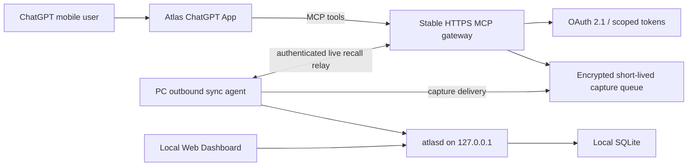

# ChatGPT Direct mobile roadmap

Status: **Planned; not shipped in v0.2.1**

## Product outcome

Atlas should work where a thought already happens: inside a ChatGPT mobile conversation. The user should not need to open a separate task app or remotely operate a desktop Dashboard just to remember or resume something.

Two interactions define the mobile experience:

1. **Say it when it happens**

   > Atlas, remember that I still need to compare the pickup times for the three summer camps.

2. **Ask when it is needed**

   > Atlas, what unfinished family tasks should I resume today?

The Dashboard remains available for batch review, search, duplicate merge, lifecycle management, backup, and settings. It is not the primary mobile entry point.

## Target user flow

### Capture

1. The user explicitly asks Atlas to remember an idea, decision, reference, or future action in ChatGPT mobile.
2. The Atlas ChatGPT App calls a scoped `capture` tool.
3. The remote gateway authenticates the user and places a minimal, idempotent envelope in a short-lived queue.
4. A sync agent on the user's computer retrieves the envelope through an outbound HTTPS connection.
5. Local `atlasd` creates a `Source`, `Capture`, `Evidence`, and `ReviewCandidate` in one transaction.
6. The user can review the candidate in ChatGPT or later in the local Dashboard before it becomes an accepted business record.

### Recall and resume

1. The user asks Atlas what remains unfinished or searches for an earlier decision.
2. The ChatGPT App calls a read-scoped tool through the gateway.
3. When the PC is online, the gateway relays the request over an authenticated outbound session established by the PC. Local `atlasd` returns only the minimum structured result and bounded source evidence.
4. ChatGPT presents the answer with source attribution and an explicit offline or stale-data state when the PC is unavailable.

## Target architecture

### Authority and trust boundaries

- `atlasd` remains the only SQLite writer.
- Local SQLite remains the runtime source of truth.
- The gateway is a transport queue, not a cloud Atlas database.
- The gateway never receives the SQLite file, backup files, or sanitized Git export.
- The PC initiates outbound HTTPS synchronization; `atlasd` remains bound to loopback and is never exposed directly to the internet.
- Capture can use the short-lived queue. Recall requires an online PC and a bounded real-time relay; the gateway does not maintain a general cloud search cache.
- Tool calls use idempotency keys, explicit versions where updates are involved, least-privilege scopes, and auditable delivery state.
- Imported text, URLs, and commands remain untrusted data and cannot trigger tools or external actions.

## Data minimization

The mobile path should transfer only what is needed to create or answer a reviewable Atlas record:

- structured candidate type and title;
- source identifier, timestamp, and content hash;
- bounded evidence excerpt when the privacy policy allows it;
- sensitivity classification and review state;
- delivery, idempotency, and expiration metadata.

By default, it must not transfer or retain:

- the full ChatGPT conversation;
- unrelated assistant responses;
- the user's complete Atlas database;
- SQLite backups, WAL, or SHM files;
- raw voice recordings;
- Restricted evidence in gateway logs, analytics, or screenshots.

Queued payloads must be encrypted in transit and at rest, have a short retention limit, and be deleted after acknowledged delivery or expiration. The exact retention target is `TBD` and must be fixed before implementation approval.

## Authentication and authorization

The production ChatGPT App requires OAuth 2.1 compatible with the MCP authorization flow. Atlas must:

- map one authenticated ChatGPT user to one Atlas installation;
- publish protected-resource and authorization-server metadata;
- validate issuer, audience/resource, expiry, scopes, and PKCE-backed authorization;
- separate read scopes from capture/update scopes;
- support revocation and device unlinking;
- never use a shared static bearer token across users or installations.

The current Windows DPAPI token remains local-only and must not be reused as the remote OAuth credential.

## Offline behavior

- **PC online:** capture and recall can complete through normal synchronization.
- **PC offline during capture:** the gateway may hold the encrypted capture until its short retention limit; ChatGPT must say that delivery is pending.
- **PC offline during recall:** ChatGPT must say that Atlas is unavailable or that any cached result may be stale. It must not invent an answer.
- **Recall timeout:** the live relay uses a fixed response deadline. On timeout, ChatGPT receives an explicit unavailable result instead of a partial or invented answer. The latency target is `TBD` before implementation approval.
- **Expired undelivered capture:** the user receives a visible failure and can retry; silent loss is not acceptable.

## Cost boundary

The local Atlas core remains usable without a paid AI API or hosted Atlas account. ChatGPT Direct is different: a stable public HTTPS gateway, identity service, monitoring, and data-transfer path may create hosting or operational costs.

Atlas must not describe ChatGPT Direct as guaranteed zero-cost. Before Beta, the project must publish who operates the gateway, what is free, what may cost money, and how a user can continue using the local-only Codex and Dashboard path without the gateway.

## Delivery phases

### Phase 1: contracts and local sync prototype

- Freeze mobile `capture`, `get_today`, `get_open_loops`, `search`, and review contracts.
- Add an outbound sync adapter without changing the schema v2 authority model.
- Prove idempotent delivery, retry, expiry, and offline states against synthetic data.
- Prove that an outbound authenticated session can relay online recall without exposing `atlasd` or opening an inbound PC port.

### Phase 2: secure remote gateway

- Deploy a stable HTTPS MCP endpoint.
- Implement OAuth 2.1, least-privilege scopes, installation linking, revocation, and audit logs without content bodies.
- Enforce encrypted short-lived queue storage and automatic deletion.

### Phase 3: ChatGPT App experience

- Register the Atlas tools and concise tool metadata.
- Support ordinary text responses first; add compact UI only where it materially improves review.
- Verify capture, recall, source display, pending delivery, stale results, and unlinking on mobile ChatGPT.

### Phase 4: security and user validation

- Threat-model account linking, replay, queue leakage, prompt injection, cross-user access, and compromised-device scenarios.
- Run privacy canaries, network observation, recovery tests, and a real mobile UAT.
- Publish verified capability and cost statements before calling the feature generally available.

## Release gates

ChatGPT Direct cannot be marked shipped until all of the following pass:

- a stable HTTPS MCP endpoint is available;
- OAuth 2.1 login, PKCE, token validation, revocation, and device unlinking pass;
- cross-user and cross-installation isolation is verified;
- local SQLite remains the only authoritative store;
- no full conversation or database backup is retained by the gateway;
- queued captures expire and delete as documented;
- offline, retry, duplicate, and idempotency flows pass;
- online recall meets its documented response deadline and offline recall fails explicitly;
- Restricted canary leakage is zero across logs, queue storage, analytics, and screenshots;
- mobile capture and sourced recall pass real-user UAT;
- public privacy, retention, operator, and cost disclosures are complete.

Until these gates pass, public materials must say **planned ChatGPT Direct mobile support**, not that Atlas already works directly inside ChatGPT mobile.

## Official OpenAI implementation references

- [Apps SDK overview](https://developers.openai.com/apps-sdk/)
- [Build an MCP server](https://developers.openai.com/apps-sdk/build/mcp-server)
- [OAuth 2.1 authentication](https://developers.openai.com/apps-sdk/build/auth)
- [Deploy a ChatGPT App](https://developers.openai.com/apps-sdk/deploy)
