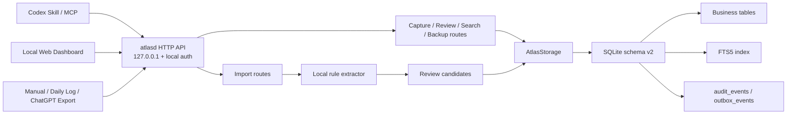
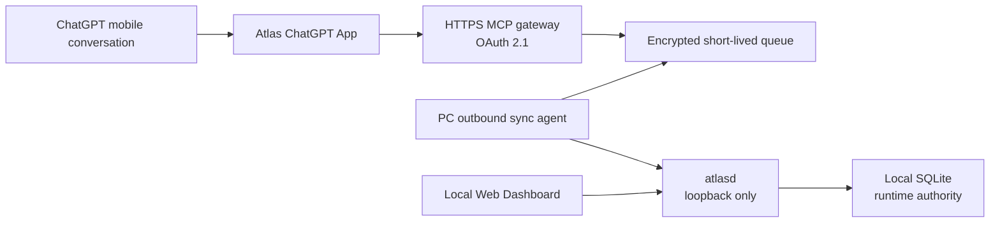

# Atlas technical reference

This document describes the verified v0.2.1 local architecture, storage boundary, entry points, and import behavior. Product setup starts in the main [README](../README.md).

## Architecture



`atlasd` is the only component that opens SQLite for writes. Web, MCP, and import clients use the HTTP API. Offline restore runs through the `atlasd` restore command and acquires the same exclusive data-directory lock.

SQLite business tables are the runtime source of truth. `audit_events` records operation facts for audit and undo; it does not replace authoritative business state. `outbox_events` supports local export and background work. Atlas does not implement event sourcing or CQRS.

## Entry points

- **Codex:** say “Remember this in Atlas,” “What unfinished work should I resume?”, or “Search Atlas for …”. The installed skill uses the local HTTP fallback when MCP is unavailable.
- **Plugin:** the Windows installer registers a package-local marketplace and installs the included Atlas plugin. Restart Codex and open a new conversation after installation.
- **Web:** the local Dashboard provides Today, Capture, Search, Review, Sources, and Settings on the selected loopback port.
- **Imports:** Manual, Daily Log, and ChatGPT Export clients call the local HTTP API.

Atlas does not claim automatic access to all ChatGPT or Codex history. MCP availability depends on the host. ChatGPT Export is the manual historical fallback.

## Capture and import behavior

An explicit Codex capture stores only the content deliberately supplied to Atlas plus source metadata. It does not silently archive the entire current conversation.

Manual ChatGPT Export import stores imported conversations locally so Atlas can extract candidates, search the text, and keep source traceability. Import requests are limited to 12 MB and 1,000 conversations.

Imports, URLs, and commands are always treated as untrusted text. For ChatGPT Export, the deterministic `competition-1` extractor reads only user/human messages. Manual and Daily Log imports are treated as user-confirmed input. The extractor emits at most three candidates in Decision → Waiting → Open Loop order and sends every result to Review.

Import endpoints:

- `POST /api/v1/imports/manual`
- `POST /api/v1/imports/daily-log`
- `POST /api/v1/imports/chatgpt-export`

All writes require an idempotency key. Update operations use expected versions and return HTTP 409 on conflicts. Deletes are soft deletes. Migrations are forward-only.

## Data protection and recovery

- Standard and Restricted records can exist in local business tables.
- Restricted content is redacted from ordinary API responses and excluded from ordinary search, sanitized Git exports, logs, screenshots, and test reports.
- `work_summary_only` stores only a minimal structured summary and source index.
- Online SQLite backup is the complete disaster-recovery source.
- JSONL/Markdown exports are sanitized, portable subsets and are not complete recovery sources.
- Windows release secrets are protected for the current user with DPAPI.
- The HTTP service binds only to `127.0.0.1`; the release launcher tries ports 4310–4319 and stops if all are occupied.

See [SECURITY.md](../SECURITY.md) for the public security boundary.

## Planned mobile architecture: ChatGPT Direct

Mobile ChatGPT integration is a future capability and is not part of the verified v0.2.1 architecture above. The selected product direction is a ChatGPT App backed by a remote HTTPS MCP gateway, rather than exposing the local Dashboard or `atlasd` to the internet.



The remote gateway is a transport boundary, not a second source of truth. It must not expose the local SQLite file, accept anonymous access, or retain the user's full Atlas database. The computer initiates outbound synchronization, and only structured captures, review candidates, source identifiers, hashes, and bounded evidence needed for review move through the synchronization path. Full mobile conversations are not copied by default.

The detailed design, delivery gates, and official OpenAI implementation references are in the [ChatGPT Direct mobile roadmap](product/chatgpt-direct-mobile-roadmap.md).

## Source development

Requirements:

- Node.js 24 or later
- pnpm 11.7.0

```powershell
pnpm install
pnpm check
pnpm start
```

For front-end development, run `pnpm dev` and `pnpm dev:web` in separate terminals, then open `http://127.0.0.1:4311`.

Runtime data defaults to `%LOCALAPPDATA%\Atlas`. Set `ATLAS_DATA_DIR` for an isolated development or test directory. The Windows portable release uses `work/data` under the extracted package instead.

## Related evidence

- [Requirements traceability](quality/requirements-traceability.md)
- [Test strategy](quality/test-strategy.md)
- [Competition evidence](competition/README.md)
- [Windows package testing](../packaging/windows/README-TESTING.md)
