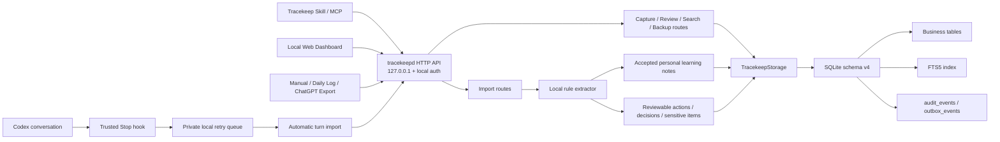
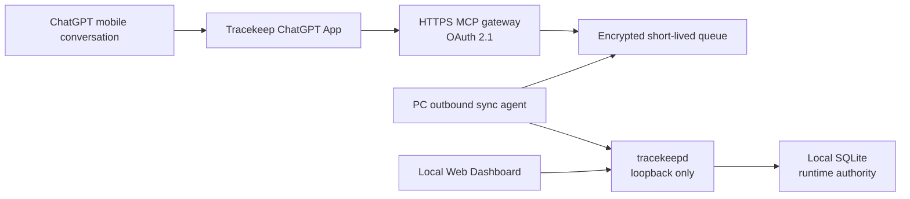

# Tracekeep technical reference

This document describes the v0.3.0 local architecture, storage boundary, automatic turn capture, and import behavior. Product setup starts in the main [README](../README.md).

## Architecture



`tracekeepd` is the only component that opens SQLite for writes. Web, MCP, and import clients use the HTTP API. Offline restore runs through the `tracekeepd` restore command and acquires the same exclusive data-directory lock.

SQLite business tables are the runtime source of truth. `audit_events` records operation facts for audit and undo; it does not replace authoritative business state. `outbox_events` supports local export and background work. Tracekeep does not implement event sourcing or CQRS.

## Entry points

- **Codex automatic capture:** after a meaningful turn finishes, the trusted Stop hook sends the bounded turn result to local `tracekeepd`. Short social turns and credential-like content are skipped.
- **Codex explicit interaction:** say “Remember this in Tracekeep,” “What unfinished work should I resume?”, or “Search Tracekeep for …”. The installed skill uses the local HTTP fallback when MCP is unavailable.
- **Plugin:** the Windows installer registers a package-local marketplace and installs the included Tracekeep plugin. Restart Codex and open a new conversation after installation.
- **Web:** the local Dashboard provides Today, Capture, Learning, Search, Review, Sources, and Settings on the selected loopback port.
- **Imports:** Manual, Daily Log, and ChatGPT Export clients call the local HTTP API.

Automatic capture covers completed turns created while the local plugin hook is installed, trusted, and enabled. Tracekeep does not claim access to all ChatGPT or Codex history. ChatGPT Export is the manual historical fallback.

## Capture and import behavior

The Codex Stop hook receives a host-provided transcript path for the completed turn. Tracekeep extracts the current turn, removes host context blocks, and sends bounded user and final-assistant text to `POST /api/v1/imports/codex-turn`. The request is idempotent by session and turn identifiers.

For personal turns, useful conclusions and document, paper, or URL references become accepted Learning Notes. Proposed Open Loops and Decisions remain in Review. Work summaries remain reviewable and persist only minimized text. Credential-like or Restricted turns are skipped by the hook. The user can disable automatic capture in Settings; explicit capture and recall continue to work.

If `tracekeepd` is temporarily unavailable, the hook writes a private local retry record. Work retry records are minimized; the queue never leaves the computer. The transcript format is host-provided and not treated as a stable historical API, so parsing fails closed.

Manual ChatGPT Export import stores imported conversations locally so Tracekeep can extract candidates, search the text, and keep source traceability. Import requests are limited to 12 MB and 1,000 conversations.

Imports, URLs, and commands are always treated as untrusted text. For ChatGPT Export, the deterministic `competition-1` extractor reads only user/human messages. Manual and Daily Log imports are treated as user-confirmed input. The extractor emits at most three candidates in Decision → Waiting → Open Loop order and sends every result to Review.

Import endpoints:

- `POST /api/v1/imports/codex-turn`
- `POST /api/v1/imports/manual`
- `POST /api/v1/imports/daily-log`
- `POST /api/v1/imports/chatgpt-export`

Learning and setting endpoints:

- `GET /api/v1/learning-notes`
- `GET /api/v1/settings/auto-capture`
- `PATCH /api/v1/settings/auto-capture`

All writes require an idempotency key. Update operations use expected versions and return HTTP 409 on conflicts. Deletes are soft deletes. Migrations are forward-only.

## Data protection and recovery

- Standard and Restricted records can exist in local business tables.
- Restricted content is redacted from ordinary API responses and excluded from ordinary search, sanitized Git exports, logs, screenshots, and test reports.
- `work_summary_only` stores only a minimal structured summary and source index.
- Online SQLite backup is the complete disaster-recovery source.
- JSONL/Markdown exports are sanitized, portable subsets and are not complete recovery sources.
- Windows release secrets are protected for the current user with DPAPI.
- The HTTP service binds only to `127.0.0.1`; the release launcher tries ports 4310–4319 and stops if all are occupied.

See [SECURITY.md](../SECURITY.md) for the public security boundary.

## Planned mobile architecture: ChatGPT Direct

Mobile ChatGPT integration is a future capability and is not part of the v0.3.0 local architecture above. The selected product direction is a ChatGPT App backed by a remote HTTPS MCP gateway, rather than exposing the local Dashboard or `tracekeepd` to the internet.



The remote gateway is a transport boundary, not a second source of truth. It must not expose the local SQLite file, accept anonymous access, or retain the user's full Tracekeep database. The computer initiates outbound synchronization, and only structured captures, review candidates, source identifiers, hashes, and bounded evidence needed for review move through the synchronization path. Full mobile conversations are not copied by default.

The detailed design, delivery gates, and official OpenAI implementation references are in the [ChatGPT Direct mobile roadmap](product/chatgpt-direct-mobile-roadmap.md).

## Source development

Requirements:

- Node.js 24 or later
- pnpm 11.7.0

```powershell
pnpm install
pnpm check
pnpm start
```

For front-end development, run `pnpm dev` and `pnpm dev:web` in separate terminals, then open `http://127.0.0.1:4311`.

Runtime data defaults to `%LOCALAPPDATA%\Tracekeep`. Set `TRACEKEEP_DATA_DIR` for an isolated development or test directory. The Windows portable release uses `work/data` under the extracted package instead.

## Related evidence

- [Requirements traceability](quality/requirements-traceability.md)
- [Test strategy](quality/test-strategy.md)
- [Competition evidence](competition/README.md)
- [Windows package testing](../packaging/windows/README-TESTING.md)
